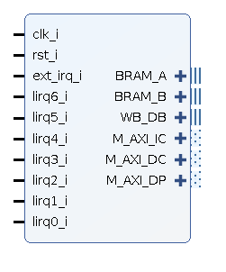

# Bonfire AXI Toplevel
Bonfire Core together with I and D Cache. Designed to work with Xilinx Vivado IP Integrator.  

### Toplevel Interfaces

Name   | Description                       |Acc | Address Range
------- |----------------------------------|----|-------------------
BRAM_A  | BRAM Port A (Data Port)           |RW  |0xC0000000-0xCFFFFFFF
BRAM_B  | BRAM Port B (Instruction Port)    |RX  |0xC0000000-0xCFFFFFFF
M_AXI_IC| AXI4 Instruction Cache Master*    |RX |0x00000000-0xBFFFFFFF
M_AXI_DC| AXI4 Data Cache Master            |RW |0x00000000-0x3FFFFFFF
M_AXI_DP| AXI4Lite Data Port                |RW |0x80000000-0xBFFFFFFF
WB_DB   | Wishbone Data Port                |RW |0x40000000-0x7FFFFFFF
clk_i   | CPU clock                         |   |
rst_i   | CPU Reset (active high)           |   |
ext_irg_i | RISC-V External Interrupt||
lirq0_i - lirq6_i | Local Interrupts 0-6 ||                           

\* All instruction fetches, expect in the BRAM Address Range are routed over the instruction cache and the M_AXI_IC Port. Trying to execute code e.g. on
peripheral address ranges is therefore not possible.
So most likely  they are "mirrored" into DRAM mapped to address 0x0000000.

### Configuration Paramters (Generics)
Remark: The Module has some more parameters than the ones documented here.
The undocumented ones should not be changed from their default values and may be removed or replaced in the near future

Name | Description | Values (Default in Bold)
-----|-------------|-------------------------
CACHE_SIZE_WORDS| Instruction Cache Size in 32Bit Words|**2048**
CACHE_LINE_SIZE_WORDS|Instruiction Cache Line Size in 32 Bit Words|**8**
USE_DCACHE| Enable Data Cache | **true** false
DCACHE_MASTER_WIDTH| Width of M_AXI_DP data port| (*32*-128) (dvidable by 8!)
DCACHE_SIZE| Data Cache Size (Width is DCACHE_MASTER_WIDTH)| **2048**
DCACHE_LINE_SIZE| Data Cache Line Size (Width is DCACHE_MASTER_WIDTH)| **8**
ENABLE_TIMER| Enable mtime and mtimecmp | **true** false
REG_RAM_STYLE| Implement CPU register file as BRAM or distributed RAM | **block** distributed

Restrictions:
* All parameters regarding memory size (cache and line sizes) must be powers of two.
* DCACHE_MASTER_WIDTH must be dividable by 8 and at least 32 Bit
* Switching off the Data Cache is currently not tested
* REG_RAM_STYLE is a string directly passed to the register file as attribute. Refer to Xilinx documentation for RAM inference on restritions.

**All the restrictions are not  explicitly checked and enforced by the code. So expect erratic behavior or at least inefficient implementations when violating this rules.**
